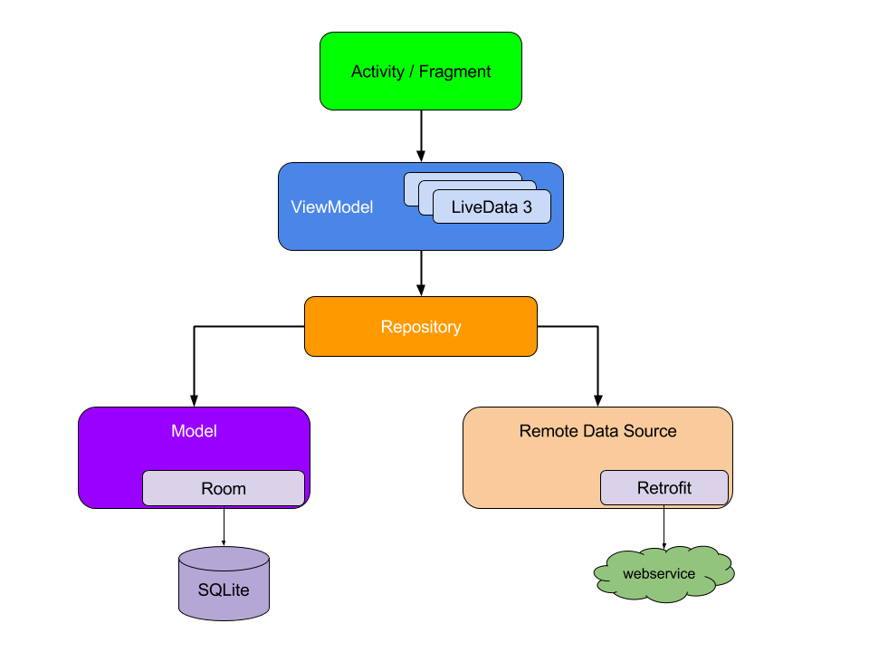

# MVVM-sample-architecture-
MVVM sample with Kotlin - Retrofit - RxJava - Dagger - Stetho - Chuck

The main purpose of this app is to show MVVM sample implementation using the new Google Architectural
components LiveData and ViewModel.

First implementation from https://github.com/hazems/mvvm-sample-app/tree/part1

 
